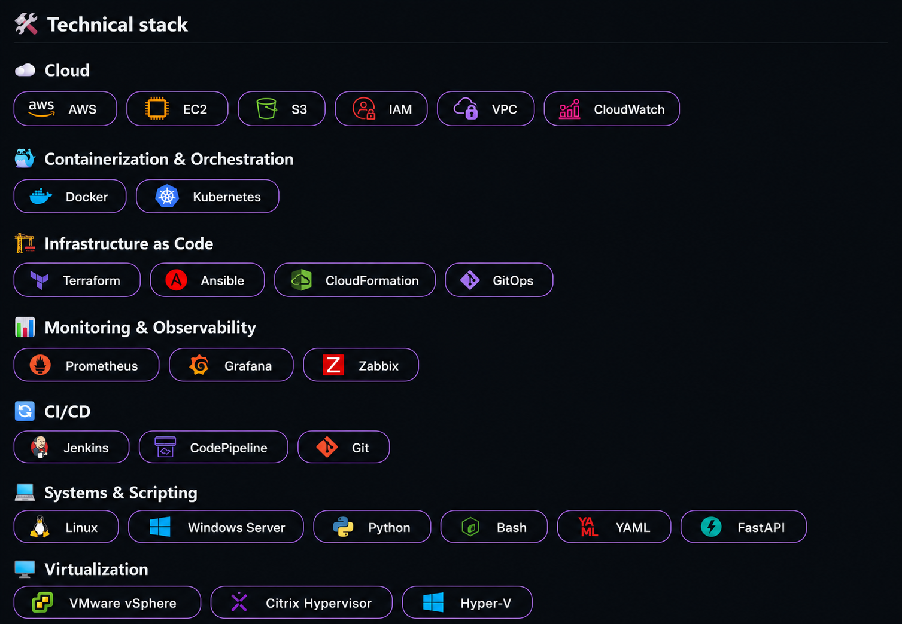

---

## 🧑‍💻 A little about me

I work on the infrastructure most people never think about — until it breaks.

Currently a **Cloud Infrastructure & Operations Engineer at Cloud4C (Capgemini)**, managing hybrid cloud environments for **1,400+ enterprise clients** across VMware, Hyper-V, XenServer, and KVM, with a growing focus on automation, observability, and reliability engineering.

I work across **AWS, Kubernetes, Docker, Terraform, GitOps, CI/CD, and observability**, and I'm actively building toward **SRE, Platform Engineering, and DevOps** roles.

I hold the **AWS Certified Solutions Architect – Associate** and **Certified Kubernetes Administrator (CKA)** certifications, and I'm continuously exploring cloud-native architecture and AI infrastructure.

### CURRENTLY EXPLORING

`Kubernetes` · `Platform Engineering` · `SRE` · `Cloud-Native Architecture` · `AI Infrastructure`

---

