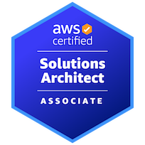
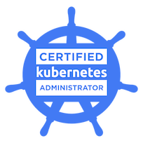
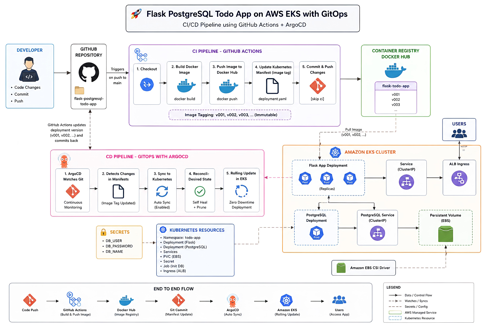
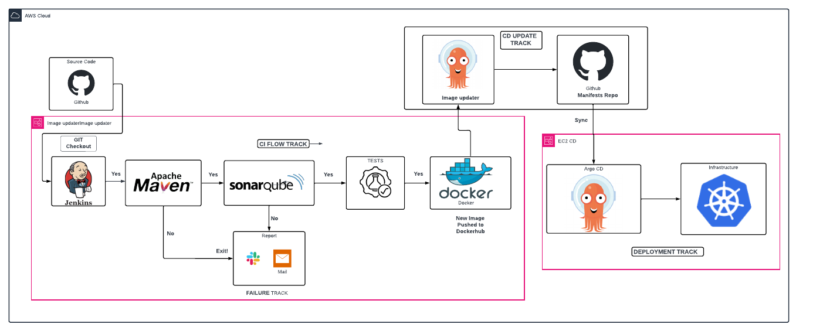

<div align="center">
  <a href="https://linkedin.com/in/krutik-ukunde/">
    
  </a>
</div>

</br>

<p align="center">
  <a href="mailto:krutiku2710@gmail.com">
    
  </a>
  &emsp;
  <a href="https://linkedin.com/in/krutik-ukunde/">
    
  </a>
  &emsp;
  <a href="https://github.com/Krutik2710">
    
  </a>
</p>

---

## 👋 Hey, I'm Krutik

I work on the infrastructure most people never think about — until it breaks.

Currently a **Cloud Infrastructure & Operations Engineer at Cloud4C (Capgemini)**, managing hybrid cloud environments for **1,400+ enterprise clients** across VMware, Hyper-V, XenServer, and KVM — with a growing focus on automation, observability, and reliability engineering.

I hold the **AWS Certified Solutions Architect – Associate** and **Certified Kubernetes Administrator (CKA)** certifications, and I'm actively building toward **SRE and Platform Engineering roles**.

<p align="center">
  <a href="assets/aws-saa.png">
    
  </a>
  &emsp;&emsp;
  <a href="assets/cka.png">
    
  </a>
</p>

---

## 🧰 Tech I Work With Daily

<p align="center">
  
  &emsp;
  
  &emsp;
  
  &emsp;
  
  &emsp;
  
</p>

<p align="center">
  
  &emsp;
  
  &emsp;
  
  &emsp;
  
  &emsp;
  
</p>

<p align="center">
  
  &emsp;
  
  &emsp;
  
  &emsp;
  
  &emsp;
  
</p>

---

## 💡 Projects

<div align="left">
  <table>
    <tr>
      <td width="50%">
        <h3 align="center"><strong>Flask PostgreSQL GitOps on EKS</strong></h3>
        </br>
        <div align="center">
          <a href="https://github.com/Krutik2710/flask-postgresql-todo-app">
            
          </a>
          </br></br>
          <p>
            <a href="https://github.com/Krutik2710/flask-postgresql-todo-app">
              
            </a>
          </p>
          </br>
          <p align="left">
            End-to-end GitOps pipeline deploying a Flask + PostgreSQL app on Amazon EKS. GitHub Actions builds and pushes Docker images, ArgoCD syncs manifests and reconciles the cluster. Zero-downtime rolling deployments with ALB Ingress and Route 53.
          </p>
          </br>
          <p>
            
            &nbsp;
            
            &nbsp;
            
            &nbsp;
            
            &nbsp;
            
            &nbsp;
            
            &nbsp;
            
          </p>
        </div>
      </td>
      <td width="50%">
        <h3 align="center"><strong>Jenkins End-to-End CI/CD</strong></h3>
        </br>
        <div align="center">
          <a href="https://github.com/Krutik2710/Jenkins-Project">
            
          </a>
          </br></br>
          <p>
            <a href="https://github.com/Krutik2710/Jenkins-Project">
              
            </a>
          </p>
          </br>
          <p align="left">
            Full CI/CD pipeline on AWS using Jenkins, Maven, and SonarQube for code quality gates. Passing builds trigger Docker image creation, push to Docker Hub, and GitOps-based deployment to Kubernetes via ArgoCD. Slack and email alerts on failure.
          </p>
          </br>
          <p>
            
            &nbsp;
            
            &nbsp;
            
            &nbsp;
            
            &nbsp;
            
            &nbsp;
            
            &nbsp;
            
          </p>
        </div>
      </td>
    </tr>
  </table>
</div>

---

## 🔖 Featured Repositories

---
<div align="center">

<div style="display: flex; justify-content: center; gap: 35px; margin-bottom: 35px;">
  <a href="https://github.com/Krutik2710/Jenkins-Project">
    
  </a>

  <a href="https://github.com/Krutik2710/flask-postgresql-todo-app">
    
  </a>
</div>

<div style="display: flex; justify-content: center; gap: 35px;">
  <a href="https://github.com/Krutik2710/my-devops-project">
    
  </a>

  <a href="https://github.com/Krutik2710/my-devops-project-aws-architecture-with-terraform">
    
  </a>
</div>

</div>
---

## 📊 By the Numbers

```
1,400+   production environments managed at Cloud4C
99.9%    uptime SLA consistently maintained
1,000+   high-priority incidents resolved within SLA
35%      reduction in MTTR via postmortem-driven runbook automation
40%      faster infrastructure deployments through Terraform + GitOps
4        engineers mentored and onboarded
```

---

## 🌱 What I'm Working On

- 🚀 **Flask PostgreSQL → EKS** — deploying a Python + PostgreSQL app through bare EC2 → Docker → Kubernetes → full GitOps with GitHub Actions and ArgoCD
- ☸️ **CNCF / LFX Mentorship** — applying for the Linux Foundation LFX Mentorship program (Term 3, 2026) under CNCF, targeting a contribution to Meshery's CI/CD pipeline workflows
- 🐹 **Learning Go** — working through the official Go tour and building CLI tools in preparation for CNCF open-source contributions
- 📊 **MLOps toolchain** — studying MLflow, Kubeflow, and model serving on Kubernetes to extend my existing infra skills into the ML layer

---

## 📈 GitHub Stats

<div align="center">
  
  </br>
  
  </br>
  
</div>

---

## 🤝 Let's Connect

I'm open to **SRE, Platform Engineering, DevOps, and Cloud Infrastructure roles**. Based in Hyderabad — open to remote and relocation.

<p align="center">
  <a href="https://linkedin.com/in/krutik-ukunde/">
    
  </a>
  &emsp;
  <a href="mailto:krutiku2710@gmail.com">
    
  </a>
</p>
