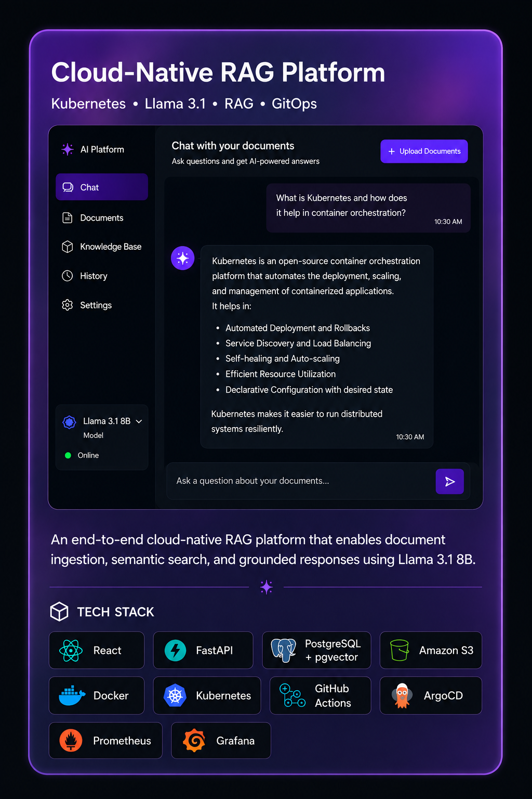
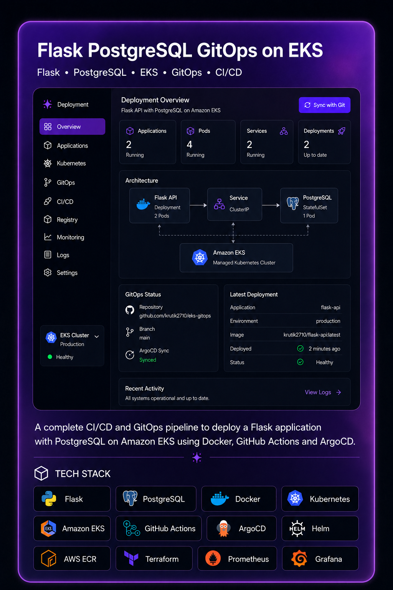

---

## 🧑‍💻 A little about me

I work on the infrastructure most people never think about — until it breaks.

Currently a **Cloud Infrastructure & Operations Engineer at Cloud4C (Capgemini)**, managing hybrid cloud environments for **1,400+ enterprise clients** across VMware, Hyper-V, XenServer, and KVM, with a growing focus on automation, observability, and reliability engineering.

I work across **AWS, Kubernetes, Docker, Terraform, GitOps, CI/CD, and observability**, and I'm actively building toward **SRE, Platform Engineering, and DevOps** roles.

I hold the **AWS Certified Solutions Architect – Associate** and **Certified Kubernetes Administrator (CKA)** certifications, and I'm continuously exploring cloud-native architecture and AI infrastructure.

<p align="center">
  
  &nbsp;&nbsp;&nbsp;
  
</p>

### CURRENTLY EXPLORING

`Kubernetes` · `Platform Engineering` · `SRE` · `Cloud-Native Architecture` · `AI Infrastructure`

---


---

## 🚀 Featured Projects

[](https://github.com/Krutik2710/ai-platform)
[](https://github.com/Krutik2710/flask-postgresql-todo-app)

---

## 💼 Experience

**Cloud Infrastructure & Operations Engineer — Cloud4C (Capgemini)**  
`Production Infrastructure` · `Hybrid Cloud` · `Virtualization` · `Observability`
```
- Managing 1,400+ production environments across VMware, Hyper-V, XenServer, and KVM.
- Maintaining 99.9% uptime while handling critical incidents, infrastructure operations,
  and SLA/SLO requirements.
- Reduced MTTR by 35% and deployment time by 40% through automation, Infrastructure as Code,
  and GitOps practices.
- Working across Linux, Windows Server, networking, monitoring, disaster recovery,
  and incident response in 24/7 production environments.
```

---

## 📫 Let's connect

<p align="center">
  <a href="https://www.linkedin.com/in/your-linkedin-handle">
    
  </a>
  <a href="mailto:krutiku2710@gmail.com">
    
  </a>
  <a href="https://github.com/Krutik2710">
    
  </a>
</p>

---


